# Unreal Engine 4 Tutorial

## Preface

Unreal engine 4 is a powerful tool that has plenty of functionality built in. If you want a powerful 3D engine to build games, demos, or music videos (like the [Crab Rave](https://www.youtube.com/watch?v=cE0wfjsybIQ)), you are in the right place. For this tutorial, I will be using version 4.25.0 but following version should be quite similar

 

## Index

1. [Install](#setup)
2. [Overview](#overview)
3. [Cloning Guide](#guide)
4. [Models & 3D](#models)
5. [Materials](#mat)
6. [Movement & Camera](#move)
7. [Lighting](#light)
8. [Water](#water)
9. [Animation](#anim)
10. [Particles](#particle)
   * [Fog](#fog)
   * [Bloom](#bloom)
11. [Coding](#code) 
12. [Events](#events)
13. [Music and Sound](#music)
14. [Misc](#misc)
15. [Demo](#demo)
16. [Resources](#help)
17. [License](#license)
18. [Collaboration](#collab)

## 1. Install

The Unreal engine is a product of Epic Games. Like Unity, it is free to use if your game makes less than $1 000 000 USD in **revenue (not profit)**. After which, 5% goes to Epic. 

1. Sign in/Register to [Epic Games](www.epicgames.com/id/login) (note you can use Google, Facebook, Xbox Live, PlayStation Network, or Nintendo to sign in)

2. Download and install the Epic Game Launcher

3. On the left tab will be a section for Unreal Engine

   

   Click it

4. As seen above, there are 5 tabs

   1. **Unreal Engine** is where you will see the news about Unreal Engine and some useful links

   2. **Learn** contains links to documentation and other exemplar content

   3. **Marketplace** is a store of assets, plugins and many other things relevant to the Unreal Engine (there are tons of free stuff from Epic and other creators so don't be afraid to import or add from the marketplace)

   4. **Library** is where you will see projects (if you have any) and the version of the Unreal Engine you will be installing. For this tutorial, I will be using 4.25.0. To add an engine, click the plus icon in the **ENGINE VERSIONS** and the newest stable version should be displayed. 

      

   5. **Twinmotion** is a CAD plugin that is irrelevant to this tutorial

5. Next click install and follow the prompts. (\*note, the install will take a long time)

6. Click Launch

7. After a couple of prompts, it will initialize and a new window asking for the project template will pop up

8. For this tutorial, we will use a blank template (**Games -> Blank**) but feel free to use one of Unreal's starting points because the template are well thought out and can be quite useful as a starting off point

9. In the project settings, I will leave it with the default but feel free to change the settings to your liking (most of options are self explanatory and you can change these options later)

10. Change the location of the project and select **Create project**

11. After initializing, you will have a new Unreal project!

\* init notes:

If you see that the new Unreal project is taking a lot of storage, it is mostly texture images, therefore, if you want to save space, simply delete the textures folder or what do what I do, which is to move all the textures outside the Unreal project and put it in another folder, only moving some textures and their normal maps when I need to use them in the project.

\* Requirement notes:

Unreal is not a trivial engine and can be quite expensive computationally. Therefore, look at the [requirements](https://docs.unrealengine.com/en-US/GettingStarted/RecommendedSpecifications/index.html) in the Unreal site to  see if your computer is up for the task of running Unreal

## 2. Unreal Editor Overview

Unreal Engine is a windowed application with many panels that are dock-able anywhere in the window. By default, the left most side is a window called **Place Actors**. This tab handles added 3D objects, including

* volumes

* characters

* lights

* cameras

* effects

* geometry, and

* more...

In the center is the scene view. This is where you can preview and play. 

On the bottom corner is the **Content Browser**, which allows you to go through files/assets in the project directory. 

Starting at the top right side is the World Outliner, this is like a layer panel in Photoshop or the scene manager in Blender. This is the area where all items in the scene can be selected and modified in the tab below. 

This tab is called **details** and does what it says. You can control the details of the item selected. For different items, theses details will be different, but a great majority will have the transform options. These transform options can move where the object is located in 3D space. In most cases however, the better way to manipulate where the object is located is with the 3D viewport.

Of course with these panels/windows, you can move any of the windows to suit them to your needs. 

One thing that is different from previous versions, is the different modes (ie paint, landscape, foliage, and geometry). By default, you will not see the different modes, so if you are following an old tutorial, don't worry, the modes are still there. Now the easiest way to access it is to use the Shift-#number shortcut. Please resort to the [Unreal documentation](https://docs.unrealengine.com/en-US/Engine/UI/LevelEditor/Modes/index.html) to stay up to date

## 3. Cloning Guide

From my [GitHub repository](https://github.com/Zeyu-Li/Unreal-template):

1. Download ZIP after clicking Clone or download

   

2. Unzip and move to desired directory

3. Launch Unreal Engine (version >= 4.25.0)

4. In the Select or Create New Project, select **More**

   

5. Click Browse... and find the place where you unzipped the download clone. Go into the folder and find the Unreal_Template.uproject and select it

6. Now the project should open

7. Go into the Content -> Maps in the Content Browser and select **Main** to go to the main level

## 4. Models & 3D

Unreal is a 3D engine, therefore, it come with many great tools and libraries. By default, Unreal will start you off with a StarterContent folder with many things including models you can drag into the scene. Of course, you can make models in a 3D program of your choice (I will use [Blender](https://www.blender.org/)) and export it as an fbx file format. The following will list some more options of 3D programs to create models:

**Software**

Free

* [Blender](https://www.blender.org/) - a very powerful open source 3D modeling, texturing, animations, and general 3D software. All my models in the exercises where made in Blender. A good place to start is with [Andrew's Donut](https://www.youtube.com/watch?v=TPrnSACiTJ4&list=PLxLGgWrla12dEW5mjO09kR2_TzPqDTXdw). New 2.8 version is very similar to all other 3D software. I **very strongly** advice you use Blender because it is free and is often much better than paid software
* [TreeIt](https://www.evolved-software.com/treeit/treeit) - a tree generator with presets that range from cactus to palm trees

Paid

* [Cinema 4D](https://www.maxon.net/en-us/products/cinema-4d/overview/) - 59.99USD/month (overpriced and not as good as Blender)
* [Autodesk Maya](https://www.autodesk.com/products/maya/overview) - 1 620 USD/year (supposedly the industry standard) \* Note I don't know if they have a 3 year free for students like other Autodesk CAD software
* [Houdini](https://www.sidefx.com/products/houdini/) - 199 USD / year
* [Substance Designer](https://www.substance3d.com/products/substance-designer) - $19.90/month (for **revenue** under \$100k) a node based texture designer. \* Note this might actually be useful, but from my experience, it is not easy to learn and textures can be found online or created with other programs like Adobe Illustrator and converted into normal maps in Blender.

\* Note don't use CAD software like Fusion 360, Revit, Solidworks etc, because those are for CAD (computer assisted design) and are aimed towards engineers. Also, Blender has Architectural Plugin with many of the functionality of Autodesk Revit. 

**Libraries**

* [Unreal Store](https://www.unrealengine.com/marketplace/en-US/store) - free and paid assets
* [Free 3D](https://free3d.com/3d-models/unity) - be careful, some items are not for commercial applications

Textures

* [3D Textures](https://3dtextures.me/)
* [TTextureHaven](https://texturehaven.com/)
* [CC0 Textures](https://cc0textures.com/)

**Unreal**

If you have experience with 3D software like Cinema 4D, Blender, or the Autodesk suit, Unreal will be very familiar to you. If you have not worked in a 3D environment, there is some adjusting. Note I will **not** go through the tools (ie rotate, scale, transform) for manipulating 3D bodies because they are the universal shortcuts (like Maya) and effects. 

First off note that you do not need to make all 3D asset body. There are many asset stores with free and paid models. Usually I will use tons of free assets from the asset package (or go to [asset store](https://assetstore.unity.com/3d)) and if I need something custom, I model it with Blender. I recommend learning a 3D software before going into Unreal because it can be translated almost directly to Unreal with light sources, objects, texture maps, etc. (my recommendation is [Blender Guru](https://www.youtube.com/user/AndrewPPrice)). 

To import 3D models/bodies, you will have to import it as a fbx file (make sure you export only the things you have selected (the model) and not everything including the camera, lights, etc. or you can choose to not import the camera or lights in Unreal) 

Now to import into Unreal

1. Click on the **Import** button in the Content Browser

2. Locate the fbx model

3. 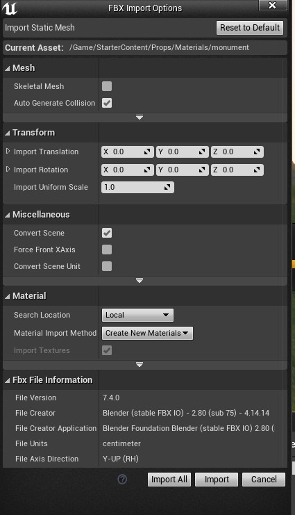

   This menu will appear and generally, the defaults are good enough

4. Click Import

5. Now you can drag the model into the scene and you will see it snapping to the face of the bottom mesh

**Landscape**

Unreal, unlike other game engines has a contained terrain generator. To enable this terrain generator,  hit shift-2. If you are working above Unreal version 4.25.0, you will see a new tab appear, however, I believe the legacy window to be better because you can quickly switch to landscape, foliage, paint, place, and more with the old menu. To enable this, go to Edit -> Editor Preferences, search legacy and the check the first result (under User Interface). After, you may need to restart, but you will see a 5 tabbed window on the left side now

Anyhow, to start creating a landscape:

1. shift-2 to get to landscape mode

2. You will see a grid that displays the area of landscape

3. (Optional) create a normal map and add it as a material to create a new landscape and you will be done

4. 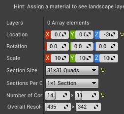

   Under the Material picker is a bunch of options (above) for you to change to your needs. You can change the displacement, rotation, or scale, but it is better to change the section size and number of components. Note you can change it to a none square grid

5. After you are satisfied with the landscape dimensions, hit **create**

6. Now you will see that a landscape is made and that you are now in paint mode

7. 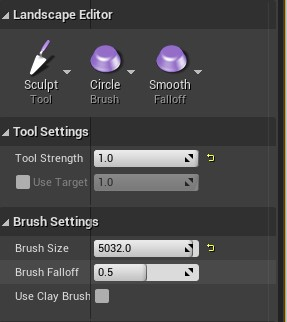

   Now you can modify your landscape with sculpting tools. This means you can do additive and subtractive changes to the mesh. In addition, you can change the "brush" size and shape 

8. **TIP** Block out the shape of the terrain first, then detail with noise, erosion, etc.

9. If you need to add or delete sections to the grid, go back to the Manage part of landscape and change the **Selection** to Add or Delete

10. Play around with the tools and don't be afraid to experiment

11. (Optional) painting in the landscape (see [materials](#mat))

    1. Follow the materials tutorial to get the right material 

    2. 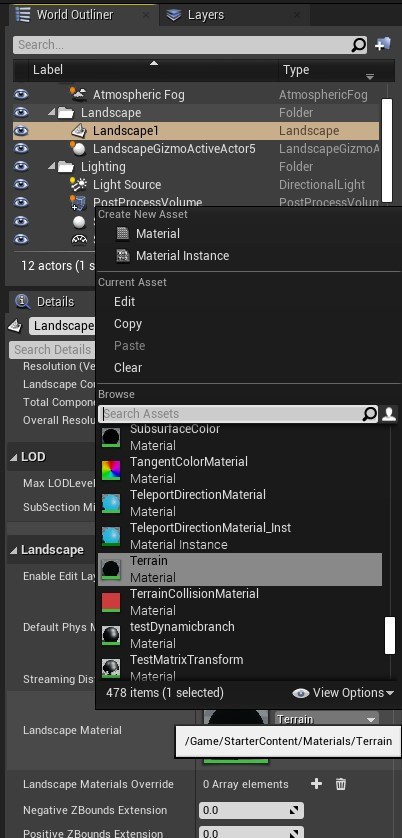

       Click on the landscape mesh and in the Landscape section, in the Landscape Material and find the terrain material (see above)

    3. Go to the landscape mode, go to paint mode and create layer info (**+** plus icon) and select Weight-Blended Layer (normal)

    4. Save it to where you want it and repeat for all the material layers

    5. Start painting!

\* You can create a landscape in another program and import it into Unreal

**Foliage**

One thing that will add that extra layer of depth is foliage, ie. trees, grass, bushes etc. Well Unreal makes this easy with the foliage tools.  No longer will you have to place foliage or even rocks by hand, the **Foliage** tool will do all of this with variation by itself

1. Find the models you need (if you need one to practice with use the rock in Content -> Models in the project, \* note I made this in Blender and I give permission for you to use it without attribution)
2. Drag the model(s) into the **Drop Foliage Here** area
3. You can change the Brush Size and Density
4. For each model, you can change the density and the scale (including some randomness) if you select it
5. If you need collision on the foliage like with trees or rocks, go down to the Instance Settings -> Collision Presents -> Block All

\* a good tool for creating tree foliage is with [TreeIt](https://www.evolved-software.com/treeit/treeit) (to use in Unreal, use this tutorial (https://youtu.be/SaW88u6u6Ks))

## 5. Materials

Materials in Unreal are node based, therefore, if you have used Blender or Substance Designer, the materials should be nearly identical. If you want to make some basic materials, just follow a Blender material tutorial and you can apply it directly to Unreal

For this tutorial, I will do something a bit different and create a landscape material to be applied with the landscape paint tool.

1. Right click on the content browser and select material

2. Rename it and double click to edit it

3. You will see the node edit now and the main node that looks exactly like Blender's Principled BSDF node

4. Right click to get the search menu (not by default, this search is case sensitive, so turn that off) and look for **Layer Blend**. This will make it such that Unreal can switch materials in paint mode 

5. 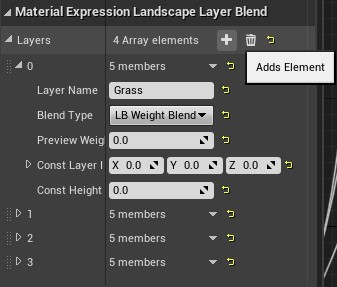

   Click on the Layer Blend and in the bottom, left side, you will see options like the one above. Here you can add paint layers. Just click the Adds Element **+** icon like the on above and you can rename it. You can add as many layers as you need. 

6. We can connect this to the base color as we are doing the base colors first

7. Add a **texture sample** node to one of the layers and in the options, change the texture to whatever you need

8. Connect the texture sample to one of the paint layers

9. If you have normal or roughness maps, repeat steps 4-8 with the normal maps

10. (Optional) since you need a roughness defined, add a constant node and set it to a float from 1 to 0, 1 being non-reflective and 8 being very reflective. You can also do this to with metallic

11. Organize nodes into groups with Ctrl-C

12. For a landscape material, add a **LandscapeCoords** node to all the texture samples so you can scale them periportally with the **Mapping Scale** options

Next I will make a plain white material

1. Right click on the content browser and select material
2. Rename it and double click to edit it
3. Add a constant3vector node and change the constant to white
4. Connect to base color
5. Add a 1 constant node to roughness
6. Exit and drag and drop to mesh (you sometimes need to build the level, otherwise you might see the text preview on the mesh, perhaps a bit distorted)

## 6. Movement & Camera

Unlike other engines, Unreal has many convenient features and templates (Unreal calls these templates "Features"). If you require a first person, third person, 2D sides roller, vehicle, AR/Virtual Reality, flying, or puzzle, Unreal has got you covered. These templates are often times a very good jumping off point. I will go through some of the popular templates below.

* first person - a character with a working gun and some blocks that are effected by the bullets
* third person - a blank manikin that has a camera controller and works like the first person controller
* 2D Side Scroller - a flat side scroller 
* vehicle - a simple vehicle template
* flying - a spaceship with a static third person camera right behind it
* puzzle - a grid of blocks that changes color and the score when clicked

These features are very feature complete and the most common modification is to remove the gun and bullets in the first person feature. 

1. Open the **FirstPersonCharacter** blueprint located in the Content -> FirstPersonBP -> Blueprints
2. Locate the Spawn projectile group and on the top left side is the InputAction Fire and the InputTouch nodes
3. Remove the two nodes
4. Now go to the viewport and select by clicking on the two guns and arms (all at once or individually, it doesn't make a difference)
5. In the Details panel, go to Render and uncheck **Visable**
6. (Optional) If you want to remove the crosshairs: 
   1. Open the FirstPersonHUB blueprint
   2. Delete the Event Receive Hand HUB node

Of course, just because you selected one of the features does not mean you are locked to the feature set. After you enter your project, you can still add any of the feature by going to your Content Browser -> Add New (in green) -> Add Feature or Content Packs

## 7. Lighting

Lighting is a massive undertaking as it sets the mood of the game and can modify how things look. There are two subsets of lighting options we will talk about, global and local. First we will tackle global lighting. 

One thing to note about Unreal is that global lighting is very intertwined. What I mean by this is that in the default scene, the Atmospheric Fog, Sky Sphere, and SkyLight are all controlled by the direction of the **light source**. This makes it such that it mimics the sun.

For my tutorial, I will be making it sunset, 

1. Change the light source to a rotation of that of a sunset. (If you are making a night scene, set it to point straight up to the sky and this [tutorial](https://www.youtube.com/watch?v=qJFaKZh1VqU))
2. Drag in a **Post Process Volume** into the scene and in the options check the **infinite Extent**. 
3. Now below the exposure details, you will see max and min brightness. Something you **need **to know about Unreal is that Unreal has a feature that adjusts the brightness depending on the surrounding. This is the auto exposure (**Eye Adaptation**) working. This will make it like your eye, which adjusts to the brightness of the surrounding. With this in mind, we will need to increase min brightness (I have mine set to 2) because that way, Unreal will not using Eye Adaptation as aggressively (max can be whatever)
4. In the light source, change in intensity to your liking and you can also change the color
5. Another thing that adds that something extra is cloud speed and opacity in the Sky Sphere
6. One other thing that may need to be change depending on the mood is global lighting. The global lighting options can be found in the world settings window

Local lighting is like any other 3D software with point, spot and directional light. There is no area light because I think there is an emissions shader node like in Blender

## 8. Water

Water features are complex and expensive graphically, however Unreal has resources to help us. In this tutorial, we will be "making" an ocean with Unreal's ocean template

1. Go to the Epic Launcher and go to the marketplace
2. Search of Water Planes by Epic Games (it should be free)
3. Click **Free** and **Add to Project**
4. Select project and comfirm
5. You should see the WaterPlane folder in your project
6. There are several options in the WaterPlane folder, so take your time and look at some of them
7. Drag the Blueprint into the scene and scale it accordingly
8. There are also other options relating the wave height, noise scale, etc. Play around with these parameters to get something that looks good for your project

## 9. Animation

Animations are important for 3D games if you doing want a static picture. To create an animation;

1. Drag in your model

2. Change it to movable

3.  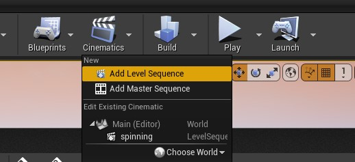

    Click **Cinematics** -> **Add Level Sequence**

4. You will see a timeline, similar to many other 3D programs

5. Right click in the layer part (left of the timeline) and select **Actor to Sequence** and find your actor (object, not the cinematics)

6. 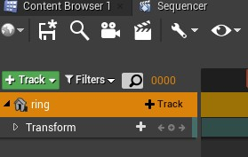

   Once hovering on the actor you will see the **+ Track**. Click it and select **Transform**

7. You can expand the transform and select the tiny **+** in the circle to keyframe it

8. You can change the interpolation to linear or cubic with the Wrench icon

9. After you are finished with the animation, go to the Level Sequence Object in the World Outliner (should look like a movie icon) adn select it

10. You will see options in Playback like Auto Play, Loop, Playback rate, and more

    

\* Note, if you want to create more complex animations, use Blueprints, which I will go in detail later. Here are some resources: 

* https://medium.com/@Luke_Marsden/simple-animation-in-ue4-e8c2529b3eb9
* https://docs.unrealengine.com/en-US/Engine/Animation/Overview/index.html

## 10. Particles

Particles add that extra layer of emersion and can change a boring static scene into a dynamic, alive scene. There are many different particles that come packaged with Unreal and this section will explore some of them. I will also go into other FX or VFX in this section like fog and bloom

**Fog**

Fog can be added in duck scenes or to add a cloud of mystery. There are two kinds of fog with Unreal, **Sky Atmosphere** and **Atmospheric Fog**. After testing, I will be using Atmospheric Fog

1. Drag an Atmospheric Fog into the scene 
2. Changing the z displacement changes the startoff level
3. There are options for fog density, height falloff (fog easing so there is no hard barrier between fog and no fog), and much more

**Bloom**

1. By default, bloom should be in the scene, but if it isn't go to Show -> Post Processing -> Bloom

   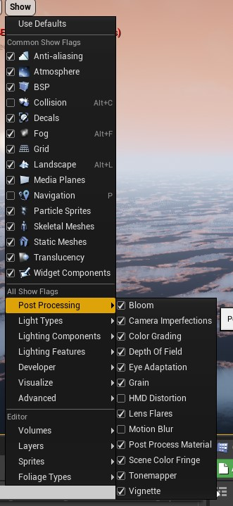

2. There are also other FX that you can add, so change them to your liking

## 11. Coding

Coding in Unreal is different from most languages. The major difference is that this is a visual programming language. It uses nodes with inputs on the left side and outputs on the write side. Of course you can code in pure C++, but we will explore the Blueprints, which is Unreal's intended way of programming in logic. 

**IMPORTANT** - there are a few ways to debug but the simplest is to use the **Print String** node. This will print a blue string in the top left corner of the screen

To start, 

1. Click Blueprints -> New Empty Blueprint Classes
2. You will be presented with a buffet of options. I will be making a bunch of objects that you need to be in, therefore, I will chose the **Actor Component**
3. You will now see the node editor
4. Another way to make a Blueprint is to go to the object and select **Blueprint/Add Script** button in the details panel
5. Yet another way to do this with a group is with the group selected, Blueprints -> Covert Section to Blueprint Classes
6. If you want to access the **Level Blueprints**, go to Blueprints -> Open Level Blueprints
7. You can right click in the node editor to search nodes to add
8. I cannot tell you everything about nodes because there are way too many to go through. The best advice I can give you is to use Unreal's documentation or watch some tutorials online. Good luck
9. Unreal's visual coding is actually just a visual representation of code (as functions) and at the end of the day, must be compiled to binary, therefore, after you are complete, compile

## 12. Events

Events are important to drive a game and to progress. Events in Unreal should be mainly handled by **Blueprints**. In this tutorial, I will go through the process of creating a bunch of areas I need to get to and move the area after you reach that location. 

1. Drag in a trigger volume (Box, capsule or sphere)

2. With the trigger selected, open the Level Blueprint

3. Right click and select Add Event for ... -> Collision -> Add on Actor Begin Overlap

4. Connect to a Cast to FirstPersonCharacter (or to whatever character you have)

5. (Optional) If you want to debug and see that it is working, connect to a print string node from the cast to first person...

6. I want it such that the object changes displacement 3 times before you win

7. 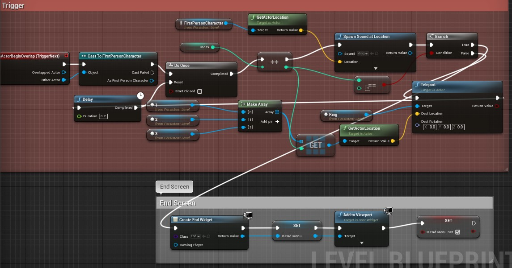

   Set up the nodes like this. I know this might be hard to follow, but this is basically coding but messier

Now you might get put off by this, but once you play around and get to know the tools, it will be easier and faster than coding it in C++

## 13. Music and Sound

**Music**

Music can be add just by dragging into the scene. To loop the music, 

1. right click on the music in the **Content Browser**
2. Click Create Cue
3. Rename and open cue
4. Sandwich a Looping node between wave player and output

**Sounds**

Sounds can add a layer of immersion to the game. In this tutorial, I will add some walking sounds

1. Locate some walking sounds online or just use the ones I have

2. Make a sound cue

3. 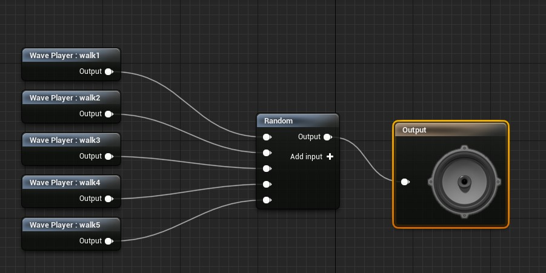

   Drag the sounds in and add a Random (while selecting the sound nodes so they automatically connect). Finally connect that to the output

4. The easiest way to play the sounds are to do it with the animations, otherwise, you may have to program in logic to play the sounds (a lot of work)

5. Since I have the 1st person controller, go to the firstperson character animation (Content -> FirstPerson -> FirstPerson_AnimBP)

6. Click on **Animation** on top right

7. Now you see the fire animation, but you want to get to the run animation, so go to the **Asset Browser **on the bottom right corner

8. Somewhere in the timeline under Notifies (doesn't matter where because we don't have a walk animation), right click and select Add Notify -> Play Sound

9. 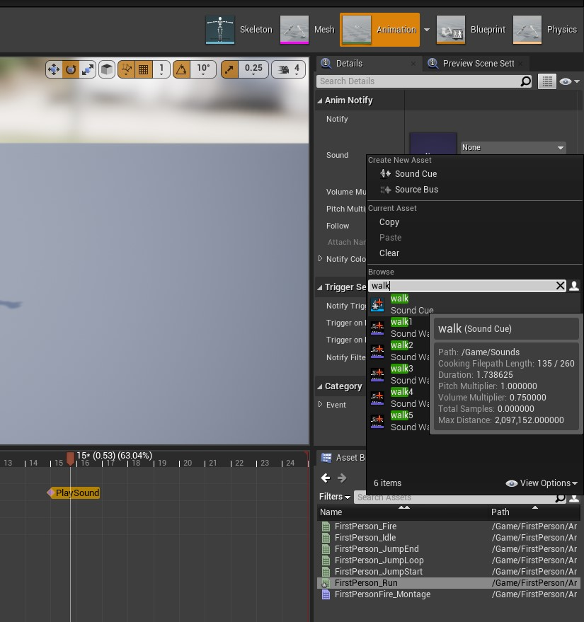

   Click on the sound keyframe and in the sound box, select the sound cue

## 14. Misc

**Moving assets**

In projects, you might want to move an asset from one project to the next. To do this in Unreal, right click on the asset and click Asset Actions -> **Migrate**...

Press Ok, then find the content folder of the project to move to and confirm

**UI**

Most games will probably require a UI (user interface), so I will go through one here on a pause menu

1. Go to project settings with **Edit** Tab

2. Go to Engine -> Input -> Bindings -> Action Mappings

3. Add another action mapping of pauseGame and add the key of choice (if you chose \<esc>, it will not work when you are running it)

4. 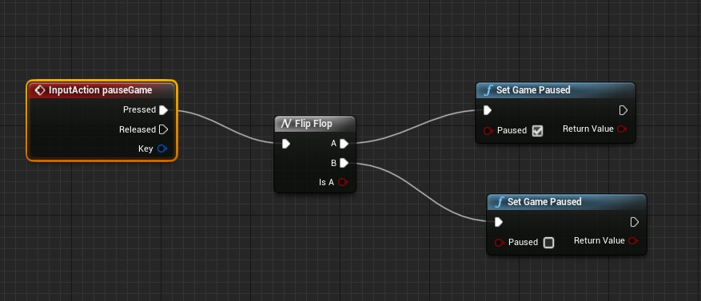

   Open your first person controller and add the node like the ones above. Also, make sure in the InputAction, the Execute when Paused checkbox on

5. Now the pausing should work, so we will do the pause menu

6. Make a new folder in Content called UI or something and **Add New** -> User Interface -> Widget Blueprint

7. Open it and you will see a UI maker

8. Add a size box to the hierarchy 

9. Play around with the Details till you get the box in a place you want

10. 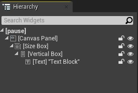

    Add a vertical box embedded in the size box and a text box inside of that. In the end, it should look like the hierarchy above

11. Edit text, add buttons, whatever you need, you can drag into the Vertical Box and they will stack on each other

12. Once you are satisfied, go back to the pause game node editor

13. 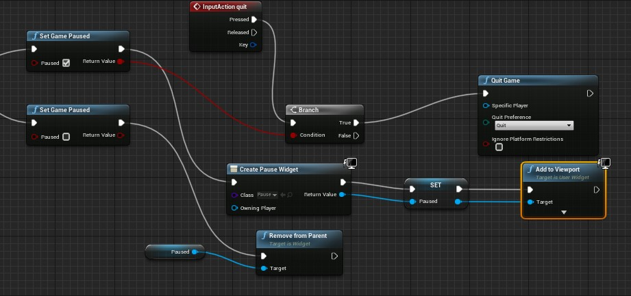

    Copy the node here, remembering to change the Create widget to the Pause UI class and the Paused variable setting to get or, follow Unreal's tutorial (second link)

**Respawn Player**

Use this: https://docs.unrealengine.com/en-US/Gameplay/HowTo/RespawnPlayer/Blueprints/index.html

Resources: 

* https://www.youtube.com/watch?v=pKggN6f_8Qo
* https://docs.unrealengine.com/en-US/Engine/UMG/HowTo/CreatingWidgets/index.html

## 15. Demo

Thank you for viewing this tutorial and I hope you enjoyed this tutorial and I wish you luck in creating your own games. While I went through just the basics of Unreal, but I hope I have sparked your motivation to create projects in Unreal. 

Thank you

 \- Andrew

P.S. If you want to provide feedback or have questions, start a issue in the GitHub repo 

This is a demo of the project I've been able to complete with ideas from this tutorial:

\* note to download this game, go to the [release](https://github.com/Zeyu-Li/Unreal-Template/releases) part of the GitHub repo hosting this project

## 16. Resources

Official Documentation: https://docs.unrealengine.com/en-US/index.html

## 17. License

This tutorial and my Unreal template game is under MIT License

## 18. Collaboration

Collaborating is made easy in Unreal with Unreal's own version control system

More info can be found in the link [here](https://docs.unrealengine.com/en-US/Engine/Basics/SourceControl/InEditor/index.html)

-----

[🔝 Back to Top](#top)