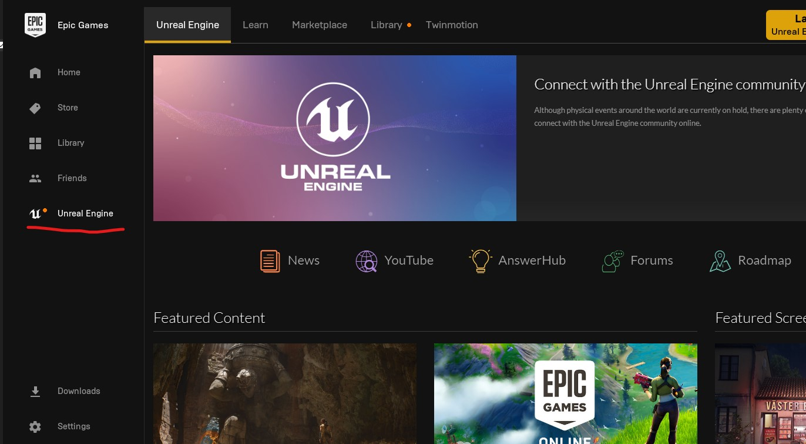
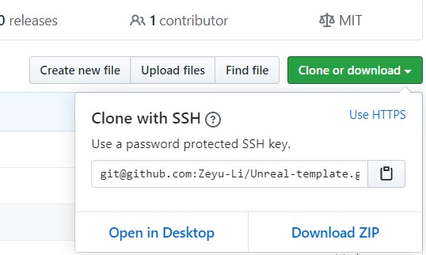
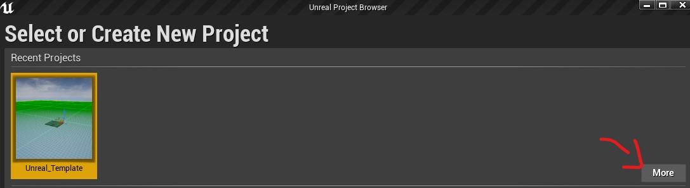

# Unreal Engine 4 Tutorial

## Preface

Unreal engine 4 is a powerful tool that has plenty of functionality built in. If you want a powerful 3D engine to build games, demos, or music videos (like the [Crab Rave](https://www.youtube.com/watch?v=cE0wfjsybIQ)), you are in the right place. For this tutorial, I will be using version 4.25.0 but following version should be quite similar

 

## Index

1. [Install](#setup)
2. [Overview](#overview)
3. [Cloning Guide](#guide)
4. [Models & 3D](#models)
5. [Movement & Camera](#move)
6. Lighting
7. Animation
8. Particles
9. Coding
10. Events
11. Music and Sound
12. Misc
13. Demo
14. [Resources](#help)
15. [License](#license)
16. [Collaboration](#collab)

## 1. Install

The Unreal engine is a product of Epic Games. Like Unity, it is free to use if your game makes less than $1 000 000 USD in **revenue (not profit)**. After which, 5% goes to Epic. 

1. Sign in/Register to [Epic Games](www.epicgames.com/id/login) (note you can use Google, Facebook, Xbox Live, PlayStation Network, or Nintendo to sign in)

2. Download and install the Epic Game Launcher

3. On the left tab will be a section for Unreal Engine

   

   Click it

4. As seen above, there are 5 tabs

   1. **Unreal Engine** is where you will see the news about Unreal Engine and some useful links

   2. **Learn** contains links to documentation and other exemplar content

   3. **Marketplace** is a store of assets, plugins and many other things relevant to the Unreal Engine (there are tons of free stuff from Epic and other creators so don't be afraid to import or add from the marketplace)

   4. **Library** is where you will see projects (if you have any) and the version of the Unreal Engine you will be installing. For this tutorial, I will be using 4.25.0. To add an engine, click the plus icon in the **ENGINE VERSIONS** and the newest stable version should be displayed. 

      

   5. **Twinmotion** is a CAD plugin that is irrelevant to this tutorial

5. Next click install and follow the prompts. (\*note, the install will take a long time)

6. Click Launch

7. After a couple of prompts, it will initialize and a new window asking for the project template will pop up

8. For this tutorial, we will use a blank template (**Games -> Blank**) but feel free to use one of Unreal's starting points because the template are well thought out and can be quite useful as a starting off point

9. In the project settings, I will leave it with the default but feel free to change the settings to your liking (most of options are self explanatory and you can change these options later)

10. Change the location of the project and select **Create project**

11. After initializing, you will have a new Unreal project!

\* init notes:

If you see that the new Unreal project is taking a lot of storage, it is mostly texture images, therefore, if you want to save space, simply delete the textures folder or what do what I do, which is to move all the textures outside the Unreal project and put it in another folder, only moving some textures and their normal maps when I need to use them in the project.

\* Requirement notes:

Unreal is not a trivial engine and can be quite expensive computationally. Therefore, look at the [requirements](https://docs.unrealengine.com/en-US/GettingStarted/RecommendedSpecifications/index.html) in the Unreal site to  see if your computer is up for the task of running Unreal

## 2. Unreal Editor Overview

Unreal Engine is a windowed application with many panels that are dock-able anywhere in the window. By default, the left most side is a window called **Place Actors**. This tab handles added 3D objects, including

* volumes

* characters

* lights

* cameras

* effects

* geometry, and

* more...

In the center is the scene view. This is where you can preview and play. 

On the bottom corner is the **Content Browser**, which allows you to go through files/assets in the project directory. 

Starting at the top right side is the World Outliner, this is like a layer panel in Photoshop or the scene manager in Blender. This is the area where all items in the scene can be selected and modified in the tab below. 

This tab is called **details** and does what it says. You can control the details of the item selected. For different items, theses details will be different, but a great majority will have the transform options. These transform options can move where the object is located in 3D space. In most cases however, the better way to manipulate where the object is located is with the 3D viewport.

Of course with these panels/windows, you can move any of the windows to suit them to your needs. 

One thing that is different from previous versions, is the different modes (ie paint, landscape, foliage, and geometry). By default, you will not see the different modes, so if you are following an old tutorial, don't worry, the modes are still there. Now the easiest way to access it is to use the Shift-#number shortcut. Please resort to the [Unreal documentation](https://docs.unrealengine.com/en-US/Engine/UI/LevelEditor/Modes/index.html) to stay up to date

## 3. Cloning Guide

From my [GitHub repository](https://github.com/Zeyu-Li/Unreal-template):

1. Download ZIP after clicking Clone or download

   

2. Unzip and move to desired directory

3. Launch Unreal Engine (version >= 4.25.0)

4. In the Select or Create New Project, select **More**

   

5. Click Browse... and find the place where you unzipped the download clone. Go into the folder and find the Unreal_Template.uproject and select it

6. Now the project should open

7. Go into the Content -> Maps in the Content Browser and select **Main** to go to the main level

## 4. Models & 3D

Unreal is a 3D engine, therefore, it come with many great tools and libraries. By default, Unreal will start you off with a StarterContent folder with many things including models you can drag into the scene. Of course, you can make models in a 3D program of your choice (I will use [Blender](https://www.blender.org/)) and export it as an fbx file format. The following will list some more options of 3D programs to create models:

**Software**

Free

* [Blender](https://www.blender.org/) - a very powerful open source 3D modeling, texturing, animations, and general 3D software. All my models in the exercises where made in Blender. A good place to start is with [Andrew's Donut](https://www.youtube.com/watch?v=TPrnSACiTJ4&list=PLxLGgWrla12dEW5mjO09kR2_TzPqDTXdw). New 2.8 version is very similar to all other 3D software. I **very strongly** advice you use Blender because it is free and is often much better than paid software
* [TreeIt](https://www.evolved-software.com/treeit/treeit) - a tree generator with presets that range from cactus to palm trees

Paid

* [Cinema 4D](https://www.maxon.net/en-us/products/cinema-4d/overview/) - 59.99USD/month (overpriced and not as good as Blender)
* [Autodesk Maya](https://www.autodesk.com/products/maya/overview) - 1 620 USD/year (supposedly the industry standard) \* Note I don't know if they have a 3 year free for students like other Autodesk CAD software
* [Houdini](https://www.sidefx.com/products/houdini/) - 199 USD / year
* [Substance Designer](https://www.substance3d.com/products/substance-designer) - $19.90/month (for **revenue** under \$100k) a node based texture designer. \* Note this might actually be useful, but from my experience, it is not easy to learn and textures can be found online or created with other programs like Adobe Illustrator and converted into normal maps in Blender.

\* Note don't use CAD software like Fusion 360, Revit, Solidworks etc, because those are for CAD (computer assisted design) and are aimed towards engineers. Also, Blender has Architectural Plugin with many of the functionality of Autodesk Revit. 

**Libraries**

* [Unreal Store](https://www.unrealengine.com/marketplace/en-US/store) - free and paid assets
* [Free 3D](https://free3d.com/3d-models/unity) - be careful, some items are not for commercial applications

Textures

* [3D Textures](https://3dtextures.me/)
* [TTextureHaven](https://texturehaven.com/)
* [CC0 Textures](https://cc0textures.com/)

**Unreal**

If you have experience with 3D software like Cinema 4D, Blender, or the Autodesk suit, Unreal will be very familiar to you. If you have not worked in a 3D environment, there is some adjusting. Note I will **not** go through the tools (ie rotate, scale, transform) for manipulating 3D bodies because they are the universal shortcuts (like Maya) and effects. 

First off note that you do not need to make all 3D asset body. There are many asset stores with free and paid models. Usually I will use tons of free assets from the asset package (or go to [asset store](https://assetstore.unity.com/3d)) and if I need something custom, I model it with Blender. I recommend learning a 3D software before going into Unreal because it can be translated almost directly to Unreal with light sources, objects, texture maps, etc. (my recommendation is [Blender Guru](https://www.youtube.com/user/AndrewPPrice)). 

To import 3D models/bodies, you will have to import it as a fbx file (make sure you export only the things you have selected (the model) and not everything including the camera, lights, etc. or you can choose to not import the camera or lights in Unreal) 

**Landscape**

Unreal, unlike other game engines has a contained terrain generator. To enable this terrain generator,  hit shift-2. If you are working above Unreal version 4.25.0, you will see a new tab appear, however, I believe the legacy window to be better because you can quickly switch to landscape, foliage, paint, place, and more with the old menu. To enable this, go to Edit -> Editor Preferences, search legacy and the check the first result (under User Interface). After, you may need to restart, but you will see a 5 tabbed window on the left side now

## 5. Movement & Camera

Unlike other engines, Unreal has many convenient features and templates (Unreal calls these templates "Features"). If you require a first person, third person, 2D sides roller, vehicle, AR/Virtual Reality, flying, or puzzle, Unreal has got you covered. These templates are often times a very good jumping off point. I will go through some of the popular templates below.

* first person - a character with a working gun and some blocks that are effected by the bullets
* third person - a blank manikin that has a camera controller and works like the first person controller
* 2D Side Scroller - a flat side scroller 
* vehicle - a simple vehicle template
* flying - a spaceship with a static third person camera right behind it
* puzzle - a grid of blocks that changes color and the score when clicked

These features are very feature complete and the most common modification is to remove the gun and bullets in the first person feature. 

1. Open the **FirstPersonCharacter** blueprint located in the Content -> FirstPersonBP -> Blueprints
2. 

Of course, just because you selected one of the features does not mean you are locked to the feature set. After you enter your project, you can still add any of the feature by going to your Content Browser -> Add New (in green) -> Add Feature or Content Packs

## 14. Resources

## 15. License

This tutorial and my Unreal template game is under MIT License

## 16. Collaboration

Collaborating is made easy in Unreal with Unreal's own version control system

More info can be found in the link [here](https://docs.unrealengine.com/en-US/Engine/Basics/SourceControl/InEditor/index.html)

-----

[🔝 Back to Top](#top)